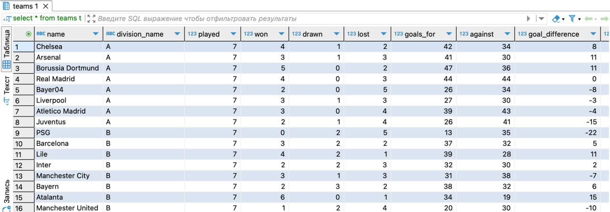

ENDPOINTS

[1] [POST] /teams
body содержит массив 16 элементов, тип string

RESPONSE:

[2-3] [POST] http://localhost:8080/api/generate/:divisionName

RESPONSE:

[4] [POST] http://localhost:8080/api/generate/play-off

RESPONSE:

Здесь F - final, QF (quarter final), SF (semi final)
На раунде плейофф 7 матчей.
first_team_id - первая команда
second_team_id - вторая команда
division_name - этап плей офф
first_team_score - забитые голы первой команды
second_team_score - забитые голы второй команды
stage - на каком этапе была игра

[5] [POST] http://localhost:8080/api/delete

Удаление старых данных для запуска нового турнира

Дополнительные данные:

Фронт не делал. Все работает через постман
Могу онлайн показать
